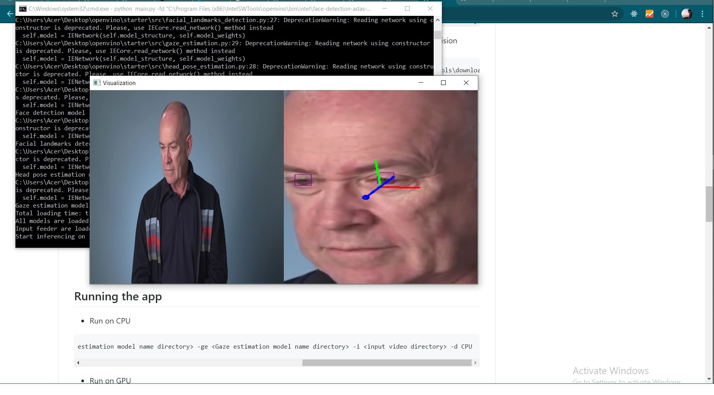
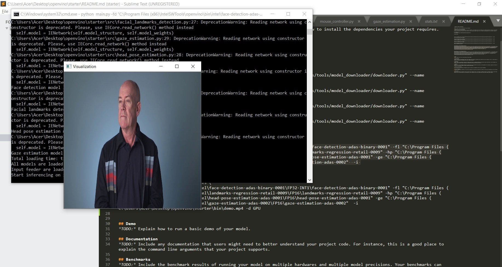

This projet a completed during UDACITY Nano degree program in which we were using models to make faster decision on computer vision tasks.

# Computer Pointer Controller

Computer Pointer Controller is an application that uses gaze detection from your input whether it is a camera or pre recorder video to control and track your mouse pointer.




## Project Set Up and Installation

### Setup 

#### Install Intel® Distribution of OpenVINO™ toolkit
for installing openvino go through this link [guide](https://docs.openvinotoolkit.org/latest/) 

#### Intsalling pre-trained models

##### First, you have to initialize openVINO Environment 

* For windows: open cmd(commnd prompt) and type following commands
```
cd C:\Program Files (x86)\IntelSWTools\openvino\bin\
```
and there after this
```
setupvars.bat
```

### Downloading Models Inference Files
there are several models are running in the background in order to make this whole project work.
first is fae detection model to recognize face
- [Face Detection Model](https://docs.openvinotoolkit.org/latest/_models_intel_face_detection_adas_binary_0001_description_face_detection_adas_binary_0001.html)
facial landmark detection to detect eye
- [Facial Landmarks Detection Model](https://docs.openvinotoolkit.org/latest/_models_intel_landmarks_regression_retail_0009_description_landmarks_regression_retail_0009.html)
head pose estimation to track the movement of head
- [Head Pose Estimation Model](https://docs.openvinotoolkit.org/
latest/_models_intel_head_pose_estimation_adas_0001_description_head_pose_estimation_adas_0001.html)
to simulate the changes 
- [Gaze Estimation Model](https://docs.openvinotoolkit.org/latest/_models_intel_gaze_estimation_adas_0002_description_gaze_estimation_adas_0002.html)

#### How to download the models

there are avrious pre-trained moel available you can easily Download Models 

* Face Detection Model
```
python "C:\Program Files (x86)\IntelSWTools\openvino_2020.3.194/deployment_tools/tools/model_downloader/downloader.py" --name "face-detection-adas-binary-0001"
```

* for landmarks-regression-retail-0009
```
python "C:\Program Files (x86)\IntelSWTools\openvino_2020.3.194/deployment_tools/tools/model_downloader/downloader.py" --name "landmarks-regression-retail-0009"
```
* for head-pose-estimation-adas-0001
```
python "C:\Program Files (x86)\IntelSWTools\openvino_2020.3.194/deployment_tools/tools/model_downloader/downloader.py" --name "head-pose-estimation-adas-0001"
```

* for gaze-estimation-adas-0002
```
python "C:\Program Files (x86)\IntelSWTools\openvino_2020.3.194/deployment_tools/tools/model_downloader/downloader.py" --name "gaze-estimation-adas-0002"
```

## Arguments Documentation 

Following are commanda line arguments that can use for while running the main.py file ` python main.py `:-
```
  1. -h                : Get the information about all the command line arguments
  2. -fd    (required) : Specify the path of Face Detection model's xml file
  3. -fl    (required) : Specify the path of Facial landmarks Detection model xml file
  3. -hp    (required) : Specify the path of Head Pose Estimation model's xml file
  4. -ge     (required) : Specify the path of Gaze Estimation model's xml file
  5. -i     (required) : Specify the path of input video file or enter cam for taking input video from webcam
  6. -d     (optional) : Specify the target device to infer the video file on the model. Suppoerted devices are: CPU, GPU,FPGA (For running on FPGA used HETERO:FPGA,CPU), MYRIAD.
  7. -l     (optional) : Specify the absolute path of cpu extension if some layers of models are not supported on the device.
  9. -pt  (optional) : Specify the probability threshold for face detection model to detect the face accurately from video frame.
  8. -flag (optional) : Specify the flags from fd, fld, hp, ge if you want to visualize the output of corresponding models of each frame (write flags with space seperation. Ex:- -flags fd fld hp).

```

## Running the app

- command to Run on CPU 

```
python <main.py directory> -fd <Face detection model name directory> -fl <Facial landmark detection model name directory> -hp <head pose estimation model name directory> -ge <Gaze estimation model name directory> -i <input video directory> -d CPU
```

- command to Run on GPU 

```
python <main.py directory> -fd <Face detection model name directory> -fl <Facial landmark detection model name directory> -hp <head pose estimation model name directory> -ge <Gaze estimation model name directory> -i <input video directory> -d GPU
```

- command to Run on FPGA 

```
python <main.py directory> -fd <Face detection model name directory> -fl <Facial landmark detection model name directory> -hp <head pose estimation model name directory> -ge <Gaze estimation model name directory> -i <input video directory> -d HETERO:FPGA,CPU
```

- command to Run on NSC2

```
python <main.py directory> -fd <Face detection model name directory> -fl <Facial landmark detection model name directory> -hp <head pose estimation model name directory> -ge <Gaze estimation model name directory> -i <input video directory> -d MYRIAD
```

## Directory Structure of the project 


- src folder contains all the source files:-
  * face_detection.py 
     - for face detection process.
     
  * facial_landmarks_detection.py
     - Take the deteted face as input,and bring landmark output
     
  * head_pose_estimation.py
     - detect head position from that movement of mouse can be estimated
     
  * gaze_estimation.py
     - compose vectors of head left eye, and right eye to predict mouse movement
     
  * input_feeder.py
     - take input whether from camera or video.
     
  * mouse_controller.py
     - Change mouse poinjter position based on output from gaze detection
  * main.py
     - begining of app
 
- bin folder contains demo video and images


## Demo

### to Running on CPU

```
python main.py -fd "C:\Program Files (x86)\IntelSWTools\openvino\bin\intel\face-detection-adas-binary-0001\FP32-INT1\face-detection-adas-binary-0001" -fl "C:\Program Files (x86)\IntelSWTools\openvino\bin\intel\landmarks-regression-retail-0009\FP16\landmarks-regression-retail-0009" -hp "C:\Program Files (x86)\IntelSWTools\openvino\bin\intel\head-pose-estimation-adas-0001\FP16\head-pose-estimation-adas-0001" -ge "C:\Program Files (x86)\IntelSWTools\openvino\bin\intel\gaze-estimation-adas-0002\FP16\gaze-estimation-adas-0002"  -i C:\Users\Acer\Desktop\openvino\starter\bin\demo.mp4 -d CPU
```



## Benchmarks

Hardware configuration: **Intel Core i5-8250U 1.6Ghz with Turbo Boost upto 3.4 GHz CPU**

The models were ran in the above configuration

## Results

### Model Size

* **face-detection-adas-binary-0001**

| Type         | Size of Model |
|--------------|---------------|
|  FP32-INT1   |  1.8M        |

* **head-pose-estimation-adas-0001**

| Type         | Size of Model |
|--------------|---------------|
|  FP16   |  3.6M       |
|  FP16-INT8   |  2.0M        |
|  FP32   |  7.3M        |

* **landmarks-regression-retail-0009**

| Type         | Size of Model |
|--------------|---------------|
|  FP16   |  423KB      |
|  FP16-INT8   | 304KB        |
|  FP32   |  766KB       |

* **gaze-estimation-adas-0002**

| Type         | Size of Model |
|--------------|---------------|
|  FP16   |  3.6M        |
|  FP16-INT8   |  2.5M      |
|  FP32   |   7.2M       |


### Model Performance

#### Combo 1
```
python main.py -fd "C:\Program Files (x86)\IntelSWTools\openvino\bin\intel\face-detection-adas-binary-0001\FP32-INT1\face-detection-adas-binary-0001" -fl "C:\Program Files (x86)\IntelSWTools\openvino\bin\intel\landmarks-regression-retail-0009\FP16\landmarks-regression-retail-0009" -hp "C:\Program Files (x86)\IntelSWTools\openvino\bin\intel\head-pose-estimation-adas-0001\FP16\head-pose-estimation-adas-0001" -ge "C:\Program Files (x86)\IntelSWTools\openvino\bin\intel\gaze-estimation-adas-0002\FP16\gaze-estimation-adas-0002"  -i C:\Users\Acer\Desktop\openvino\starter\bin\demo.mp4 -d CPU
```

* Total loading time: 1560 ms
* Total Inference time :  88seconds
* FPS :  0.6689 frame/second

|Model|	Type|Load Time in Sec|
|---|---|---|
|face-detection-adas-binary-0001| FP32-INT1 |563.2 ms|
|head-pose-estimation-adas-0001 | FP16 |285.2 ms|
|landmarks-regression-retail-0009 | FP16 | 266.7 ms|
|gaze-estimation-adas-0002 | FP16 | 368.6 ms|

#### Combo 2

```
python main.py -fd "C:\Program Files (x86)\IntelSWTools\openvino\bin\intel\face-detection-adas-binary-0001\FP32-INT1\face-detection-adas-binary-0001" -fl "C:\Program Files (x86)\IntelSWTools\openvino\bin\intel\landmarks-regression-retail-0009\FP32\landmarks-regression-retail-0009" -hp "C:\Program Files (x86)\IntelSWTools\openvino\bin\intel\head-pose-estimation-adas-0001\FP32\head-pose-estimation-adas-0001" -ge "C:\Program Files (x86)\IntelSWTools\openvino\bin\intel\gaze-estimation-adas-0002\FP32\gaze-estimation-adas-0002"  -i C:\Users\Acer\Desktop\openvino\starter\bin\demo.mp4 -d CPU
```

* Total loading time: 1603ms
* Total Inference time :  88seconds
* FPS : 0.6681 frame/second

|Model|	Type|Load Time in Sec|
|---|---|---|
|face-detection-adas-binary-0001| FP32-INT1 |576.4 ms|
|head-pose-estimation-adas-0001 | FP32 |369.2 ms|
|landmarks-regression-retail-0009 | FP32 | 264.7 ms|
|gaze-estimation-adas-0002 | FP32 |  333.3 ms|


#### Combo 3
```
python main.py -fd "C:\Program Files (x86)\IntelSWTools\openvino\bin\intel\face-detection-adas-binary-0001\FP32-INT1\face-detection-adas-binary-0001" -fl "C:\Program Files (x86)\IntelSWTools\openvino\bin\intel\landmarks-regression-retail-0009\FP16-INT8\landmarks-regression-retail-0009" -hp "C:\Program Files (x86)\IntelSWTools\openvino\bin\intel\head-pose-estimation-adas-0001\FP16-INT8\head-pose-estimation-adas-0001" -ge "C:\Program Files (x86)\IntelSWTools\openvino\bin\intel\gaze-estimation-adas-0002\FP16-INT8\gaze-estimation-adas-0002"  -i C:\Users\Acer\Desktop\openvino\starter\bin\demo.mp4 -d CPU
```

* Total loading time: 1885ms
* Total Inference time :  87 seconds
* FPS : 0.6681 frame/second

|Model|	Type|Load Time in Sec|
|---|---|---|
|face-detection-adas-binary-0001| FP32-INT1 |579.4 ms|
|head-pose-estimation-adas-0001 | FP16-INT8 |474.8 ms|
|landmarks-regression-retail-0009 | FP16-INT8 | 303.2ms|
|gaze-estimation-adas-0002 | FP16-INT8 |  526.8 ms|


## Stand Out Suggestions

Compared their performances by inference time, frame per second and model loading time.

- We ran models with different precision, but as it is very obvious that cahnage in precision also affects the accuracy. we can also decrese the model size, and we also do on several cases by  lowing the precision from FP32 to FP16 or INT8 and inference. this also helps to make interferance but because of lowing the precision model can lose some of the important information. and due to this accuracy of model can decrease. so it is very obvious to observe the size accuracy tradeoff.

- So when we use lower precision model then you can get lower accuracy than higher precision model but the model size are also small.
- For FP16-INT8, i found that it was quite good picking up the gaze and head eastimation though giving error when stuck at the corner of screen.
- Though i didnt use any VPU/GPU or hybrids, but we can say the still in Intel i5 the inference speed is good.


### Edge Cases
1. lighting is one of the major factor if face detection and gaze estimation.

2. If gaze detection is off the mointer tends to move in same direction

3. failed if more than one face detected
